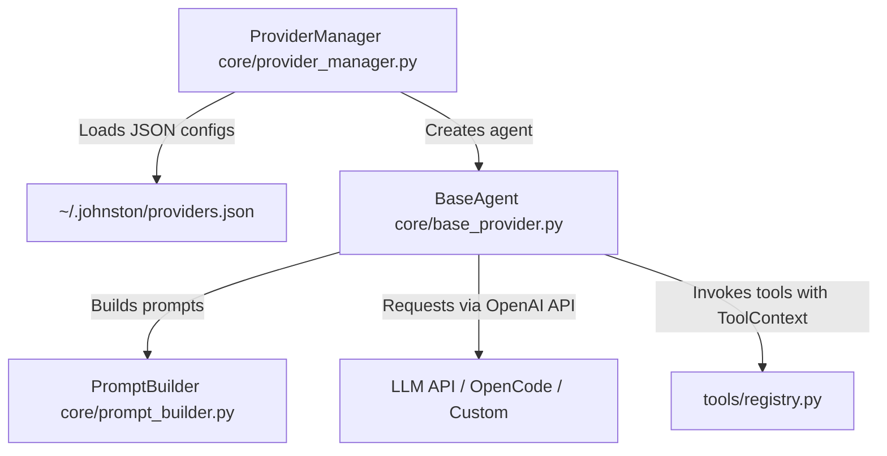

# AI Agents and Providers in Johnston

The project uses a modular architecture for configuring and executing AI agents. Users can switch providers and models on the fly directly from the interface or via slash commands.

---

## Agent Architecture



---

## 1. Providers

All providers are defined via clean JSON in `~/.johnston/providers.json` or built-in defaults in `ProviderManager` ([core/provider_manager.py](file:///Users/yegor/johnston/core/provider_manager.py)).

### Provider JSON Configuration Example (`~/.johnston/providers.json`):
```json
{
  "opencode": {
    "key": "opencode",
    "name": "OpenCode",
    "description": "OpenCode agent provider",
    "base_url": "https://opencode.ai/zen/go/v1",
    "model": "deepseek-v4-flash",
    "api_type": "openai"
  },
  "clinepass": {
    "key": "clinepass",
    "name": "ClinePass",
    "description": "ClinePass AI provider",
    "base_url": "https://api.cline.bot/api/v1",
    "model": "cline-pass/deepseek-v4-flash",
    "models": [
      "cline-pass/deepseek-v4-flash",
      "cline-pass/mimo-v2.5"
    ],
    "api_type": "openai"
  }
}
```

---

## 2. Base Agent Class (`BaseAgent`) and `PromptBuilder`

Defined in [core/base_provider.py](file:///Users/yegor/johnston/core/base_provider.py).
* Uses `openai.AsyncOpenAI` client.
* Delegates dynamic prompt and tool schema construction to `PromptBuilder` ([core/prompt_builder.py](file:///Users/yegor/johnston/core/prompt_builder.py)) considering active MCPs, Skills, and mode (Plan/Build).
* **Dynamic metadata and project instructions**: `PromptBuilder` automatically appends to system prompt:
  * Environment metadata: CWD, local time, OS, Git status (current branch, modified/untracked files count).
  * Project instructions: contents of `AGENTS.md`, `CLAUDE.md`, `.cursorrules`, or `CONVENTIONS.md` from the working directory.
* **Automatic and Manual Context Compaction**:
  * `BaseAgent` monitors history token usage and automatically compacts history via LLM summaries upon reaching 75% of context window limit.
  * Manual compaction is available via `/compact` slash command.
* Implements `stream_steps(user_text)` method:
  * Streams token chunks from the model.
  * Parses reasoning/thinking chains and renders them in the UI.
  * Recognizes tool calls (`tool_calls`), delegates execution to `execute_tool`, and sends results back to the model.

---

## 3. Tool Execution and `ToolContext`

Tools are isolated in [tools/](file:///Users/yegor/johnston/tools/).
All available tools are registered in [tools/registry.py](file:///Users/yegor/johnston/tools/registry.py). UI isolation from business logic is guaranteed via `ToolContext` ([tools/context.py](file:///Users/yegor/johnston/tools/context.py)). Built-in tools include: `read`, `create`, `edit`, `bash`, `ask_user`, `skill`, `call_mcp_tool`, `manage_task`, `subagent`, `manage_subagent`, `view_image`. Large output truncation is handled via `truncate_output`.

### How to Add a New Tool:
1. Create `tools/my_tool.py` inheriting from `BaseTool`:
   ```python
   from tools.base import BaseTool

   class MyCustomTool(BaseTool):
       name = "MyToolName"
       description = "What this tool does"
       schema = {
           "type": "function",
           "function": {
               "name": "MyToolName",
               "description": "What this tool does",
               "parameters": { ... }
           }
       }

       async def execute(self, args: dict, app=None) -> str:
           ctx = self._ensure_context(app)
           ctx.notify("Executing tool...")
           return "Result string"
   ```
2. Register the class in `TOOL_CLASSES` inside [tools/registry.py](file:///Users/yegor/johnston/tools/registry.py).
3. Tool schemas are pulled automatically via `get_default_tools()`. Manual `TOOLS` overrides in provider configs are not required!

---

## 4. Slash Commands and Action / Explore Modes

All slash commands are handled in [core/commands.py](file:///Users/yegor/johnston/core/commands.py) with automatic normalization of Cyrillic homoglyphs (to handle wrong keyboard layout input).

### Modes:
* **Action** (`/action`, aliases: `/build`, `/code`) — standard execution mode with full permissions for creating/editing files and executing bash commands.
* **Explore** (`/explore`, aliases: `/plan`, `/ask`) — read-only exploratory mode (code exploration, Q&A, planning). Direct code modifications are prohibited.

### Available Slash Commands:
* `/connect` — connect provider and setup API key.
* `/models` — select model grouped by provider.
* `/compact` — force history compaction.
* `/init` — interactive generation/update of `AGENTS.md` for current repository.
* `/skills`, `/mcp` — manage skills and MCP servers.
* `/tasks` — view and manage background tasks.
* `/subagents` — view and manage subagents.
* `/rewind`, `/resume` — rewind chat history or resume session.

* `/new`, `/help` — start new chat / view keyboard shortcuts help.

### Shortcuts & Switching:
* `Shift+Tab` — quick toggle between `action` and `explore`.

---

## 5. Subagents (Subagents & Subagent Tool)

The project supports running autonomous isolated subagents for subtasks:
* **`SubagentTool`** (`tools/subagent.py`): tool to launch a subtask subagent.
  * `subagent_type`: `"general"` (multi-step) or `"explore"` (fast code search).
  * `background`: `false` (synchronous waiting for result in `<task_result>`) or `true` (background async execution with auto notification on completion).
* **`ManageSubagentTool`** (`tools/manage_subagent.py`): tool to inspect, list, terminate, or message subagents.
  * `action`: `"list"`, `"status"`, `"kill"`, or `"send_message"`.
  * `send_message`: sends follow-up prompts to ANY subagent (including `COMPLETED` subagents, which WILL automatically resume and respond).
* **Isolation**: subagents run in isolated `BaseAgent` context without recursive access to `Subagent` tool.

---

## 6. Testing and Linting

All unit tests are isolated in [tests/](file:///Users/yegor/johnston/tests/).

* **Run tests**:
  ```bash
  uv run python -m unittest discover -s tests
  ```
* **Run linter**:
  ```bash
  uv run ruff check .
  ```

---

## 7. UI and Design System (Monochrome Slate)

The project uses a monochrome design system based on Textual TCSS ([app.tcss](file:///Users/yegor/johnston/app.tcss)), with color constants centralized in [core/config.py](file:///Users/yegor/johnston/core/config.py):
* **Accent Color**: Pure white (`#ffffff` / `THEME_PRIMARY`) for user text, active options in OptionList/suggestions menu, and main titles.
* **Background Palette**: `#09090b` (`THEME_BG` — chat screen), `#18181b` (`THEME_CARD` — cards, input field, popups, Toast notifications, footer), `#27272a` (`THEME_BORDER` — borders and dividers).
* **Toast Notifications**: `#18181b` cards with monochrome left accent bar (`#ffffff` / `#a1a1aa`).
* **Welcome Screen**: `WelcomeWidget` splash screen with `johnston` logo centered in empty chat.

---

## 8. Deployment & Publishing

### Automated Release via GitHub Actions (`release-please`):
Releases and PyPI publishing are automated using Google's `release-please` ([.github/workflows/release-please.yml](file:///Users/yegor/johnston/.github/workflows/release-please.yml)).

Simply use **Conventional Commits**:
* `fix: description` -> automatically bumps patch version (`0.1.4` -> `0.1.5`).
* `feat: description` -> automatically bumps minor version (`0.1.4` -> `0.2.0`).
* `feat!: description` -> automatically bumps major version (`0.1.4` -> `1.0.0`).
* `chore:`, `docs:`, `style:` -> no release trigger.

When you `git push origin main`, GitHub Actions will manage a Release PR. Once merged (or on push), `release-please` automatically bumps `pyproject.toml`, generates `CHANGELOG.md`, creates a GitHub Release, builds the wheel, and publishes to PyPI.

### Manual Local Build (Optional):
```bash
uv build
uv publish
```

### Installation Options for Users:
* **Run directly via `uvx`**:
  ```bash
  uvx johnston
  ```
* **Install globally via `uv`**:
  ```bash
  uv tool install johnston
  ```
* **One-liner shell script**:
  ```bash
  curl -fsSL https://raw.githubusercontent.com/p4ulbr4dl3y/johnston/main/install.sh | bash
  ```