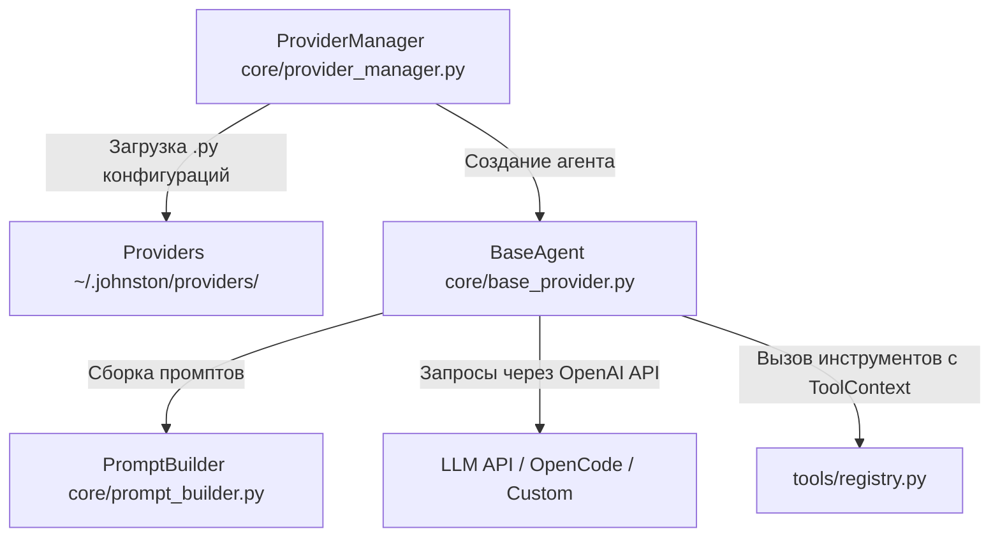

# AI Agents and Providers in Johnston Chat

В проекте используется модульная архитектура для настройки и выполнения AI-агентов. Пользователь может переключать провайдеров и модели "на лету" прямо из интерфейса или через слэш-команды.

---

## Архитектура Агентов



---

## 1. Провайдеры (Providers)

Каждый провайдер описывается отдельным `.py` файлом в директории `~/.johnston/providers/`.
При старте приложения `ProviderManager` ([core/provider_manager.py](file:///Users/yegor/tui/core/provider_manager.py)) динамически импортирует эти файлы. По умолчанию использует шаблон [templates/opencode_provider.py.template](file:///Users/yegor/tui/templates/opencode_provider.py.template).

### Пример конфигурации провайдера (`~/.johnston/providers/opencode.py`):
```python
try:
    from core.base_provider import BaseAgent
except ImportError:
    from base_provider import BaseAgent

NAME = "OpenCode Go (DeepSeek v4 Flash)"
KEY = "opencode"
DESCRIPTION = "OpenCode Go agent (DeepSeek v4 Flash) with tools"

BASE_URL = "https://opencode.ai/zen/go/v1"
MODEL = "deepseek-v4-flash"
API_KEY = "sk-..."

SYSTEM_PROMPT = "You write code..."
TOOLS = [
    {
        "type": "function",
        "function": {
            "name": "Read",
            "description": "Read file content.",
            "parameters": { ... }
        }
    }
]

class Agent(BaseAgent):
    def __init__(self, api_key: str = API_KEY, model: str = MODEL, base_url: str = BASE_URL):
        super().__init__(
            api_key=api_key,
            model=model,
            base_url=base_url,
            system_prompt=SYSTEM_PROMPT,
            tools=TOOLS,
            provider_key=KEY
        )
```

---

## 2. Базовый класс агента (`BaseAgent`) и `PromptBuilder`

Определен в [core/base_provider.py](file:///Users/yegor/tui/core/base_provider.py).
* Использует асинхронный клиент `openai.AsyncOpenAI`.
* Делегирует динамическую сборку промптов и схем инструментов в `PromptBuilder` ([core/prompt_builder.py](file:///Users/yegor/tui/core/prompt_builder.py)) с учетом активных MCP, навыков (Skills) и режима (Plan/Build).
* Реализует метод `stream_steps(user_text)`:
  * Получает поток токенов (chunks) от модели.
  * Парсит мыслительные цепочки (reasoning/thinking) и выводит их в UI.
  * Распознает вызовы инструментов (`tool_calls`), передает их в реестр `execute_tool` и отправляет результаты обратно модели.

---

## 3. Выполнение Инструментов (Tools) и `ToolContext`

Инструменты изолированы в директории [tools/](file:///Users/yegor/tui/tools/).
Все доступные инструменты регистрируются в [tools/registry.py](file:///Users/yegor/tui/tools/registry.py). Изоляция UI от бизнес-логики обеспечивается объектом `ToolContext` ([tools/context.py](file:///Users/yegor/tui/tools/context.py)).

### Как добавить новый инструмент:
1. Создайте файл `tools/my_tool.py`, унаследовав `BaseTool`:
   ```python
   from tools.base import BaseTool

   class MyCustomTool(BaseTool):
       name = "MyToolName"
       description = "What this tool does"

       async def execute(self, args: dict, app=None) -> str:
           ctx = self._ensure_context(app)
           ctx.notify("Executing tool...")
           return "Result string"
   ```
2. Зарегистрируйте класс в `TOOL_CLASSES` внутри [tools/registry.py](file:///Users/yegor/tui/tools/registry.py).
3. Добавьте описание схемы инструмента в массив `TOOLS` нужного провайдера в `~/.johnston/providers/`.

---

## 4. Режимы Plan и Build (Plan & Build Modes)

Поддерживается переключение режимов функционирования агента:
* **`plan`**: Исследовательский режим. Запрещает модификацию исходного кода (инструменты `Edit`/`Create` ограничены записью только файла `.johnston/plans/plan.md`). Добавляет системную команду написать план и инструмент `PlanExit`.
* **`build`**: Стандартный режим исполнения. Предоставляет полный доступ к правке файлов и выполнению команд bash.

### Команды и переключение:
* `/plan` — включить режим `plan`.
* `/build` — включить режим `build`.
* `/mode` — переключить режим.
* `Shift+Tab` — быстрая клавиша переключения `plan` <-> `build`.
* Инструмент `PlanExit` (`tools/plan_exit.py`) вызывается моделью по завершении планирования для запроса переключения в `build`.

---

## 5. Субагенты (Subagents & Task Tool)

Проект поддерживает запуск автономных изолированных субагентов для подзадач:
* **`TaskTool`** (`tools/task.py`): инструмент для создания субагента подзадачи.
  * `subagent_type`: `"general"` (мультишаговый) или `"explore"` (быстрый поиск кода).
  * `background`: `false` (синхронное ожидание результата в `<task_result>`) или `true` (фоновое асинхронное исполнение с авто-уведомлением в чате по финишу).
* **Изоляция**: субагент запускается в изолированном контексте `BaseAgent` без рекурсивного доступа к инструменту `Task`.

---

## 6. Тестирование и Линтинг

Все юнит-тесты изолированы в директории [tests/](file:///Users/yegor/tui/tests/).

* **Запуск тестов**:
  ```bash
  uv run python -m unittest discover -s tests
  ```
* **Запуск линтера**:
  ```bash
  uv run ruff check .
  ```

---

## 7. UI и Дизайн-система (Monochrome Slate)

Проект использует монохромную дизайн-систему на базе Textual TCSS ([app.tcss](file:///Users/yegor/tui/app.tcss)):
* **Акцентный цвет**: Чистый белый (`#ffffff`) для текста сообщений пользователя, активных выделений в OptionList/меню подсказок и главных заголовков.
* **Палитра фона**: `#09090b` (экран чата), `#18181b` (карточки, инпут ввода, всплывающие окна, уведомления Toast, футер), `#27272a` (бордеры и разделители).
* **Уведомления (Toast)**: Плашки `#18181b` с монохромной левой акцентной полосой (`#ffffff` / `#a1a1aa`).
* **Экран приветствия**: Заставка `WelcomeWidget` с логотипом `johnston` по центру пустого чата.
