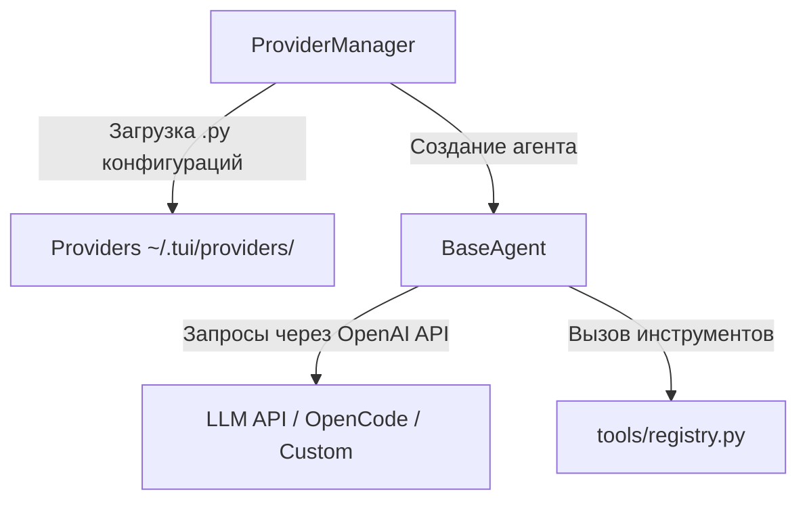

# AI Agents and Providers in TUI Chat

В проекте используется модульная архитектура для настройки и выполнения AI-агентов. Пользователь может переключать провайдеров и модели "на лету" прямо из интерфейса или через слэш-команды.

---

## Архитектура Агентов



---

## 1. Провайдеры (Providers)

Каждый провайдер описывается отдельным `.py` файлом в директории `~/.tui/providers/`.
При старте приложения `ProviderManager` динамически импортирует эти файлы.

### Пример конфигурации провайдера (`~/.tui/providers/opencode.py`):
```python
from base_provider import BaseAgent

NAME = "OpenCode Go (DeepSeek v4 Flash)"
KEY = "opencode"
DESCRIPTION = "OpenCode Go agent (DeepSeek v4 Flash) with tools"

BASE_URL = "https://opencode.ai/zen/go/v1"
MODEL = "deepseek-v4-flash"
API_KEY = "sk-..."

SYSTEM_PROMPT = "You write code..."
TOOLS = [
    {
        "type": "function",
        "function": {
            "name": "Read",
            "description": "Read file content.",
            "parameters": { ... }
        }
    }
]

class Agent(BaseAgent):
    def __init__(self, api_key: str = API_KEY, model: str = MODEL, base_url: str = BASE_URL):
        super().__init__(
            api_key=api_key,
            model=model,
            base_url=base_url,
            system_prompt=SYSTEM_PROMPT,
            tools=TOOLS
        )
```

---

## 2. Базовый класс агента (`BaseAgent`)

Определен в [base_provider.py](file:///Users/yegor/tui/base_provider.py).
* Использует асинхронный клиент `openai.AsyncOpenAI`.
* Реализует метод `stream_steps(user_text)`:
  * Получает поток токенов (chunks) от модели.
  * Парсит мыслительные цепочки (reasoning/thinking) и выводит их в UI.
  * Распознает вызовы инструментов (`tool_calls`), передает их в реестр `execute_tool` и отправляет результаты обратно модели.

---

## 3. Выполнение Инструментов (Tools)

Инструменты изолированы в директории [tools/](file:///Users/yegor/tui/tools/).
Все доступные инструменты регистрируются в [tools/registry.py](file:///Users/yegor/tui/tools/registry.py).

### Как добавить новый инструмент:
1. Создайте файл `tools/my_tool.py`, унаследовав `BaseTool`:
   ```python
   from tools.base import BaseTool
   
   class MyCustomTool(BaseTool):
       name = "MyToolName"
       description = "What this tool does"
       
       async def execute(self, args: dict, app=None) -> str:
           return "Result string"
   ```
2. Зарегистрируйте класс в `TOOL_CLASSES` внутри [tools/registry.py](file:///Users/yegor/tui/tools/registry.py).
3. Добавьте описание схемы инструмента в массив `TOOLS` нужного провайдера в `~/.tui/providers/`.

---

## 4. Режимы Plan и Build (Plan & Build Modes)

Поддерживается переключение режимов функционирования агента:
* **`plan`**: Исследовательский режим. Запрещает модификацию исходного кода (инструменты `Edit`/`Create` ограничены записью только файла `.tui/plans/plan.md`). Добавляет системную команду написать план и инструмент `PlanExit`.
* **`build`**: Стандартный режим исполнения. Предоставляет полный доступ к правке файлов и выполнению команд bash.

### Команды и переключение:
* `/plan` — включить режим `plan`.
* `/build` — включить режим `build`.
* `/mode` — переключить режим.
* Инструмент `PlanExit` (`tools/plan_exit.py`) выживается моделью по завершении планирования для запроса переключения в `build`.

